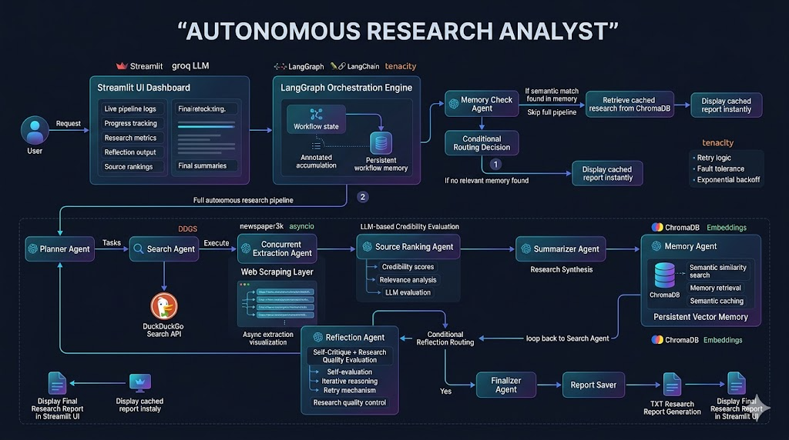

# 🔎 Autonomous Research Analyst

<div align="center">
  
</div>

---

## 📌 Overview

The **Autonomous Research Analyst** is a highly capable, AI-powered multi-agent system designed to autonomously plan, execute, and evaluate comprehensive internet research. 

Built with **LangGraph** and powered by **Groq (Llama 3.3)**, this system operates like a senior human researcher. Give it a topic, and it will break down the problem, search the web, read articles, rank them by credibility, summarize the findings, and self-reflect to determine if more research is required—all before delivering a polished final report.

## ✨ Key Features

- **🧠 Multi-Agent Orchestration**: Specialized AI agents (Planner, Searcher, Extractor, Ranker, Summarizer, and Evaluator) collaborate to produce high-quality research.
- **⚡ Semantic Memory (Chroma DB)**: The system remembers past research. If you ask it to research a topic it already knows, it instantly pulls the comprehensive report from its vector database, saving API costs and time.
- **🌐 Live Web Search & Scraping**: Uses DuckDuckGo to find the latest information and `newspaper3k` to concurrently scrape deep content from web pages.
- **🔄 Iterative Self-Reflection**: A dedicated reflection agent critiques the generated summary and forces the system to perform additional research loops if it finds missing perspectives or weak evidence.
- **📊 Beautiful Streamlit UI**: A live, interactive dashboard that shows pipeline execution progress, live agent logs, extracted metrics, and organized report tabs.

## 🧠 Advanced AI Engineering Concepts

- Stateful graph orchestration using LangGraph
- Reflection-driven iterative reasoning
- Semantic caching using vector similarity search
- Concurrent asynchronous web extraction
- Conditional routing and adaptive execution
- Source credibility ranking using LLM evaluation
- Persistent vector memory with ChromaDB
- Retry-safe fault tolerant retrieval pipelines

---

## 🏗️ System Architecture & Workflow

The intelligence of this system lies in its State Graph workflow:

1. **Memory Check Agent**: Instantly queries Chroma DB to see if the topic has already been researched. If yes, it pulls the cached report and skips to the end.
2. **Planner Agent**: Breaks the user's query down into a clear, actionable research plan.
3. **Search Agent**: Executes targeted web searches to find relevant URLs.
4. **Extraction Agent**: Concurrently scrapes the content from the retrieved web pages, safely handling timeouts and retries.
5. **Ranking Agent**: Evaluates the scraped evidence for credibility, relevance, and bias, assigning a score and justification.
6. **Summarizer Agent**: Synthesizes the raw data and rankings into a comprehensive, professional summary outlining findings, trends, opportunities, and risks.
7. **Reflection Agent**: Critiques the summary. If the research is deemed shallow or incomplete, it routes the system back to the Search Agent for another iteration.
8. **Memory & Finalizer Agent**: Saves the final approved report locally and embeds the summary into Chroma DB for future use.

---

## 💻 Tech Stack

- **Frameworks**: [LangGraph](https://python.langchain.com/docs/langgraph) (Agent Orchestration), [LangChain](https://python.langchain.com/)
- **LLM Provider**: [Groq](https://groq.com/) (Llama-3.3-70b-versatile)
- **Vector Database**: [ChromaDB](https://www.trychroma.com/)
- **Web Tools**: DuckDuckGo Search (`ddgs`), Newspaper3k
- **Frontend UI**: [Streamlit](https://streamlit.io/)
- **Utilities**: `loguru` (Logging), `tenacity` (Retry logic), `asyncio` (Concurrent scraping)

---

## 🚀 Getting Started

### 1. Prerequisites
Ensure you have Python 3.10+ installed.

### 2. Installation
Clone the repository and install the required dependencies:
```bash
git clone https://github.com/yourusername/autonomous-research-analyst.git
cd autonomous-research-analyst
pip install -r requirements.txt
```

### 3. Environment Variables
You need a Groq API key to power the LLM. Create a `.env` file in the root directory:
```env
GROQ_API_KEY=your_groq_api_key_here
```

### 4. Run the Application
Launch the Streamlit dashboard:
```bash
streamlit run ui.py
```
This will open the user interface in your default web browser (usually at `http://localhost:8501`).

---

## 📂 Project Structure

```text
├── agents/                  # Individual AI agent nodes
│   ├── planner.py           # Creates research plans
│   ├── search_agent.py      # Executes web queries
│   ├── extraction_agent.py  # Scrapes web content
│   ├── ranking_agent.py     # Evaluates source credibility
│   ├── summarizer_agent.py  # Generates the comprehensive report
│   ├── reflection_agent.py  # Critiques the report
│   ├── memory_check_agent.py# Checks Chroma DB for cached research
│   ├── memory_agent.py      # Stores results in Chroma DB
│   └── finalizer_agent.py   # Saves the report to disk
├── config/
│   └── llm_config.py        # Groq API configuration
├── graphs/
│   └── workflow.py          # LangGraph state machine definition
├── memory/
│   └── chroma_store.py      # ChromaDB client and logic
├── prompts/
│   └── research_prompts.py  # System prompts for agents
├── tools/
│   ├── search_tool.py       # DuckDuckGo integration
│   ├── scraper_tool.py      # Newspaper3k asynchronous extraction
│   └── report_saver.py      # File saving utility
├── state/
│   └── state.py             # TypedDict graph state definition
├── ui.py                    # Streamlit frontend
├── main.py                  # CLI fallback execution
└── requirements.txt         # Project dependencies
```

---

## 📝 License
This project is open-source and available under the MIT License.
